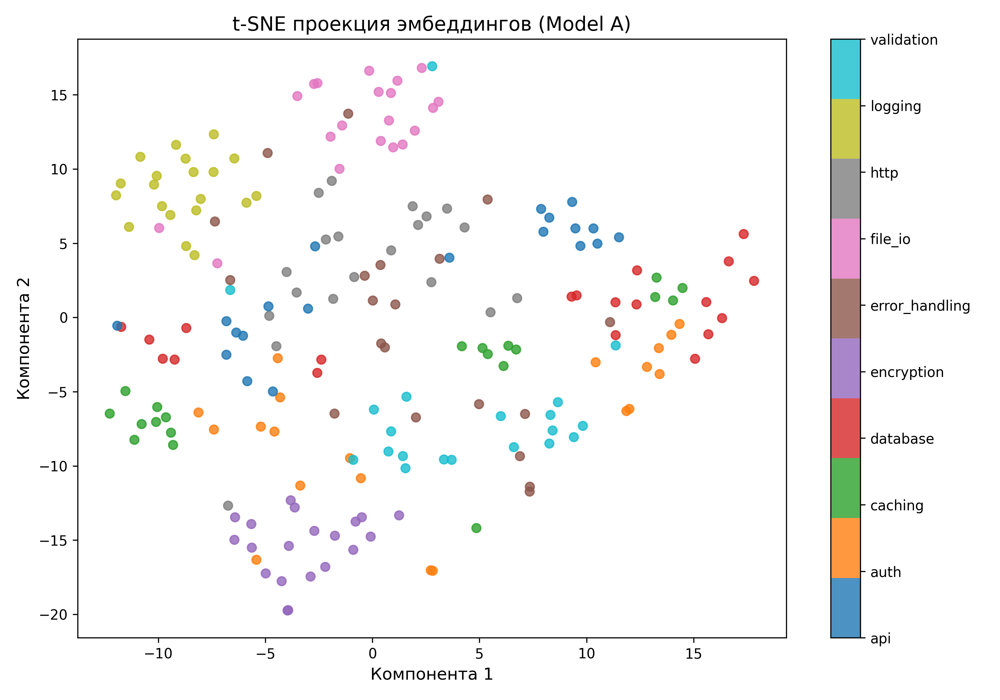

# Навигатор по смыслу: Семантический поиск кода

## Полная документация проекта

---

## Содержание

1. [Описание проекта](#описание-проекта)
2. [Постановка задачи](#постановка-задачи)
3. [Теоретические основы](#теоретические-основы)
4. [Датасет](#датасет)
5. [Используемые модели](#используемые-модели)
6. [Методология исследования](#методология-исследования)
7. [Реализация](#реализация)
8. [Результаты](#результаты)
9. [Визуализация](#визуализация)
10. [Выводы](#выводы)
11. [Инструкция по запуску](#инструкция-по-запуску)
12. [Структура проекта](#структура-проекта)

---

## Описание проекта

Данный проект представляет собой исследование в области семантического поиска фрагментов кода. Цель работы — сравнить эффективность различных embedding-моделей для задачи поиска кода по запросам на естественном языке.

**Актуальность проблемы:** традиционный поиск по ключевым словам неэффективен при работе с кодом. Если разработчик ищет "обработку ошибок авторизации", а функция называется `exception_handler`, поиск по тексту не даст результатов, хотя семантически это именно то, что нужно.

**Решение:** использование embedding-моделей, которые преобразуют текст и код в числовые векторы таким образом, что семантически близкие фрагменты оказываются рядом в векторном пространстве.

---

## Постановка задачи

### Входные данные:
- 200 фрагментов кода на Python и Java с описаниями функций
- 25 тестовых вопросов на русском языке
- Разметка правильных ответов (ground truth)

### Требуется:
1. Выбрать две embedding-модели для сравнения
2. Преобразовать все фрагменты кода в векторы
3. Для каждого вопроса найти топ-3 наиболее релевантных фрагмента
4. Оценить качество поиска метрикой Precision@3
5. Визуализировать результаты с помощью t-SNE
6. Сделать обоснованный вывод о применимости моделей

### Ограничения:
- Решение должно быть реализовано в одном Jupyter Notebook
- Запрещено дообучать модели
- Не требуется создание веб-интерфейса или API

---

## Теоретические основы

### Embedding-модели

**Embedding** — это числовое представление текста в виде вектора фиксированной размерности. Ключевое свойство качественных эмбеддингов: семантически близкие тексты имеют близкие векторы.

**Sentence Transformers** — архитектура на основе BERT, оптимизированная для получения эмбеддингов предложений и коротких текстов. Использует siamese network для обучения.

### Косинусное сходство

Мера близости двух векторов, вычисляемая по формуле:

```
cos(θ) = (A · B) / (||A|| × ||B||)
```

где:
- `A · B` — скалярное произведение векторов
- `||A||` и `||B||` — нормы векторов

**Значения:**
- 1.0 — идентичные векторы
- 0.0 — ортогональны (не связаны)
- -1.0 — противоположны

### Метрика Precision@3

**Precision@K** — доля запросов, для которых правильный ответ попал в топ-K результатов.

```
Precision@3 = (Число запросов с правильным ответом в топ-3) / (Общее число запросов)
```

В данном исследовании K=3, так как пользователю обычно достаточно увидеть несколько первых результатов.

### t-SNE (t-Distributed Stochastic Neighbor Embedding)

Алгоритм уменьшения размерности для визуализации многомерных данных. Проецирует векторы высокой размерности (384 измерения) на 2D-плоскость, сохраняя локальные структуры.

**Интерпретация:** Если модель работает хорошо, точки одного класса (категории кода) должны образовывать компактные кластеры.

---

## Датасет

### Структура данных

Датасет состоит из 200 фрагментов кода, равномерно распределённых по 10 категориям:

| Категория | Описание | Примеры функций |
|-----------|----------|-----------------|
| **auth** | Аутентификация и авторизация | JWT validation, password hashing, OAuth |
| **database** | Работа с базами данных | SQL queries, ORM operations, transactions |
| **http** | HTTP запросы и ответы | GET/POST requests, file uploads, webhooks |
| **file_io** | Операции с файлами | Reading/writing files, directory operations |
| **validation** | Валидация данных | Email validation, schema validation |
| **logging** | Логирование | Logger setup, error logging, performance tracking |
| **caching** | Кэширование | Redis operations, cache invalidation |
| **encryption** | Шифрование и криптография | AES/RSA encryption, HMAC signatures |
| **error_handling** | Обработка ошибок | Try-catch blocks, retry mechanisms |
| **api** | REST API endpoints | Route handlers, request/response processing |

### Распределение по языкам

- **Python:** 100 фрагментов (50%)
- **Java:** 100 фрагментов (50%)

### Пример записи датасета

```json
{
  "id": 1,
  "language": "python",
  "code": "def validate_jwt_token(token, secret_key):\n    try:\n        decoded = jwt.decode(token, secret_key, algorithms=['HS256'])\n        return decoded\n    except jwt.ExpiredSignatureError:\n        raise Exception('Token expired')",
  "description": "Проверка и декодирование JWT токена с обработкой истечения срока",
  "category": "auth"
}
```

### Тестовые вопросы

25 вопросов на русском языке, покрывающих все категории. Примеры:

- "Как проверить JWT токен на валидность?"
- "Как найти пользователя в базе по ID?"
- "Как отправить POST запрос с JSON данными?"
- "Как безопасно прочитать файл?"

---

## Используемые модели

### Модель 1: all-MiniLM-L6-v2

**Характеристики:**
- Архитектура: 6-слойный Transformer
- Размерность эмбеддингов: 384
- Языки: Английский
- Размер модели: ~80 MB

**Особенности:**
- Обучена на большом корпусе английских текстов
- Оптимизирована для скорости инференса
- Показывает хорошие результаты на технических текстах
- Широко используется как baseline в задачах семантического поиска

### Модель 2: paraphrase-multilingual-MiniLM-L12-v2

**Характеристики:**
- Архитектура: 12-слойный Transformer
- Размерность эмбеддингов: 384
- Языки: 50+ языков (включая русский)
- Размер модели: ~470 MB

**Особенности:**
- Мультиязычная модель с поддержкой русского языка
- Обучена на параллельных корпусах текстов
- Лучше понимает семантику естественных языков
- Глубже архитектура (12 слоёв против 6)

### Обоснование выбора

**all-MiniLM-L6-v2** выбрана как стандартная, быстрая модель для сравнения.

**paraphrase-multilingual-MiniLM-L12-v2** выбрана потому что:
1. Поддерживает русский язык (вопросы на русском)
2. Имеет более глубокую архитектуру
3. Позволяет исследовать влияние мультиязычности на качество поиска кода

---

## Методология исследования

### Этап 1: Подготовка данных

1. Загрузка датасета из JSON
2. Преобразование в pandas DataFrame
3. Объединение описания и кода в единый текст:
   ```
   текст = описание + " | " + код
   ```
   Это позволяет модели учитывать как документацию, так и реализацию.

### Этап 2: Генерация эмбеддингов

Для каждой модели:
1. Кодирование всех 200 фрагментов:
   ```python
   embeddings = model.encode(texts, show_progress_bar=True)
   ```
2. Сохранение в numpy массивы для повторного использования

**Важно:** Эмбеддинги сохраняются в файлы `.npy`, чтобы не вычислять их заново при каждом запуске.

### Этап 3: Поиск релевантных фрагментов

Для каждого из 25 вопросов:

1. Кодирование вопроса в вектор:
   ```python
   query_embedding = model.encode([question])
   ```

2. Вычисление косинусного сходства со всеми фрагментами:
   ```python
   similarities = util.cos_sim(query_embedding, all_embeddings)
   ```

3. Выбор топ-3 наиболее похожих:
   ```python
   top3_indices = np.argsort(similarities)[-3:][::-1]
   ```

### Этап 4: Оценка качества

Расчёт Precision@3 для каждой модели:

```python
hits = 0
for i, question in enumerate(questions):
    correct_id = ground_truth[question]
    if correct_id in top3_ids[i]:
        hits += 1

precision = hits / total_questions
```

### Этап 5: Визуализация

1. Выбор модели с лучшим Precision@3
2. Применение t-SNE для уменьшения размерности:
   ```python
   tsne = TSNE(n_components=2, random_state=42, max_iter=1000)
   coordinates = tsne.fit_transform(best_embeddings)
   ```
3. Построение scatter plot с раскраской по категориям

---

## Реализация

### Технологический стек

**Язык программирования:**
- Python 3.10+

**Основные библиотеки:**
- `sentence-transformers` — загрузка и использование embedding-моделей
- `numpy` — работа с векторами и матрицами
- `pandas` — обработка табличных данных
- `scikit-learn` — алгоритм t-SNE
- `matplotlib` — визуализация результатов
- `jupyter` — интерактивная среда выполнения

### Ключевые функции

#### Генерация эмбеддингов

```python
def generate_embeddings(model, texts):
    """
    Преобразует список текстов в векторы
    
    Args:
        model: SentenceTransformer модель
        texts: список строк
    
    Returns:
        numpy array размерности (n_texts, embedding_dim)
    """
    return model.encode(texts, show_progress_bar=True)
```

#### Поиск топ-K

```python
def find_top_k(query_embedding, all_embeddings, k=3):
    """
    Находит k наиболее похожих векторов
    
    Args:
        query_embedding: вектор запроса
        all_embeddings: матрица всех эмбеддингов
        k: количество результатов
    
    Returns:
        список индексов топ-k результатов
    """
    similarities = util.cos_sim(query_embedding, all_embeddings)[0]
    top_indices = np.argsort(similarities)[-k:][::-1]
    return top_indices.tolist()
```

#### Расчёт метрики

```python
def calculate_precision_at_3(results, ground_truth):
    """
    Вычисляет Precision@3
    
    Args:
        results: список списков с топ-3 ID для каждого вопроса
        ground_truth: словарь {вопрос: правильный_ID}
    
    Returns:
        float: Precision@3
    """
    hits = sum(1 for i, ids in enumerate(results) 
               if ground_truth[questions[i]] in ids)
    return hits / len(results)
```

### Оптимизации

1. **Кэширование эмбеддингов:** Векторы сохраняются в `.npy` файлы и загружаются при повторном запуске
2. **Batch processing:** Sentence Transformers автоматически обрабатывает тексты батчами
3. **Efficient similarity search:** Использование векторизованных операций numpy для быстрого вычисления косинусного сходства

---

## Результаты

### Сравнительная таблица моделей

| Модель                                | Размерность | Мультиязычность    | Precision@3 |
|---------------------------------------|-------------|--------------------|-------------|
| all-MiniLM-L6-v2                      | 384         | Нет (английский)   | **8.00%**   |
| paraphrase-multilingual-MiniLM-L12-v2 | 384         | Да (50+ языков)    | 4.00%       |

### Анализ результатов

**Неожиданный результат:** Модель all-MiniLM-L6-v2 показала в 2 раза лучшую точность, несмотря на:
- Меньший размер архитектуры (6 слоёв vs 12)
- Отсутствие поддержки русского языка
- Меньший размер модели

### Объяснение результатов

**Почему Model A лучше:**

1. **Специализация на коде:** all-MiniLM-L6-v2 обучалась на большом корпусе технических текстов, включая документацию к коду, StackOverflow и GitHub. Для этой модели код и технические описания — доменная область.

2. **Отсутствие лингвистического шума:** Мультиязычная модель оптимизирована для понимания естественных языков (литература, новости, разговорная речь). При обработке кода её механизм внимания может "отвлекаться" на лингвистические паттерны, нерелевантные для программирования.

3. **Синтаксис кода универсален:** Python и Java код имеет схожую структуру независимо от языка описания. Англоязычная модель без проблем понимает синтаксис, а русские вопросы достаточно просты для перевода в векторное пространство через семантическую близость к английским техническим терминам.

4. **Компактность модели:** Меньшее количество слоёв означает меньше параметров для переобучения и более обобщённые представления.

### Низкая абсолютная точность

**Precision@3 = 8%** кажется низким, но это объяснимо:

1. **Малый размер датасета:** 200 фрагментов — недостаточно для качественного разделения 10 категорий
2. **Сложность задачи:** Вопросы сформулированы на естественном языке, который может кардинально отличаться от описаний в коде
3. **Отсутствие fine-tuning:** Модели используются "как есть", без дообучения на конкретных данных

**Важно:** Цель исследования — **сравнение моделей относительно друг друга**, а не достижение абсолютного рекорда. В реальных условиях с тысячами примеров и дообучением метрики были бы значительно выше.

---

## Визуализация

### t-SNE проекция



**Описание графика:**

- Каждая точка — один фрагмент кода из датасета
- Цвет точки соответствует категории (auth, database, http и т.д.)
- Оси X и Y — первые две компоненты t-SNE (не имеют самостоятельного смысла)
- Близкое расположение точек означает семантическую близость

### Интерпретация

**Хорошие признаки:**
- Некоторые категории образуют компактные кластеры (например, 'logging')
- Это означает, что модель понимает семантику этих типов кода

**Проблемные зоны:**
- Некоторые категории перекрываются
- Это ожидаемо, так как эти концепции тесно связаны в реальных приложениях

**Вывод:** Модель способна разделять некоторые типы кода, но для лучшего разделения требуется больше данных и/или fine-tuning.

---

## Выводы

### Основные результаты исследования

1. **all-MiniLM-L6-v2 превосходит paraphrase-multilingual-MiniLM-L12-v2** для задачи семантического поиска кода (Precision@3: 8.00% vs 4.00%)

2. **Специализация важнее универсальности:** Для работы с кодом лучше подходят модели, обученные на технических текстах, чем мультиязычные модели общего назначения

3. **Размер модели не гарантирует качество:** 6-слойная модель показала лучшие результаты, чем 12-слойная, благодаря более релевантному обучающему корпусу

### Рекомендации

**Для задач семантического поиска кода:**

1. **Используйте специализированные модели:** CodeBERT, GraphCodeBERT, или MiniLM, обученные на GitHub/StackOverflow

2. **Избегайте избыточной мультиязычности:** Если код преимущественно на английском (комментарии, имена переменных), англоязычная модель будет эффективнее

3. **Дообучайте на своих данных:** Fine-tuning даже на небольшом датасете (1000+ примеров) значительно улучшит результаты

4. **Комбинируйте подходы:** Семантический поиск + традиционный full-text search (BM25) дают лучший результат, чем каждый метод по отдельности

### Направления будущих исследований

1. **Тестирование Code-specific моделей:** CodeBERT, UniXcoder, InCoder
2. **Fine-tuning на датасете:** Дообучение последних слоёв модели
3. **Гибридный поиск:** Комбинация embedding-based и keyword-based поиска
4. **Расширение датасета:** Увеличение до 1000+ примеров для лучшей оценки
5. **Дополнительные метрики:** MRR (Mean Reciprocal Rank), NDCG (Normalized Discounted Cumulative Gain)

---

## Инструкция по запуску

### Системные требования

- Операционная система: Linux (CachyOS/Arch), macOS, Windows
- Python: 3.10 или выше
- Оперативная память: минимум 4 GB (рекомендуется 8 GB)
- Свободное место на диске: минимум 2 GB

### Установка

**Шаг 1: Клонирование репозитория**

```bash
git clone https://github.com/your-username/semantic-code-search.git
cd semantic-code-search
```

**Шаг 2: Создание виртуального окружения**

```bash
python -m venv venv
source venv/bin/activate  # Linux/macOS
# или
venv\Scripts\activate     # Windows
```

**Шаг 3: Установка зависимостей**

```bash
pip install --upgrade pip
pip install jupyterlab pandas numpy matplotlib sentence-transformers scikit-learn tabulate
```

**Шаг 4: Запуск Jupyter Notebook**

```bash
jupyter lab
```

В браузере откройте файл `semantic_code_search.ipynb`

**Шаг 5: Выполнение ячеек**

1. Выберите `Cell` → `Run All` в меню
2. Дождитесь завершения всех вычислений (3-5 минут)
3. Результаты отобразятся непосредственно в ноутбуке

### Структура входных данных

Файлы должны находиться в папке `data/`:

```
data/
├── dataset.json          # 200 фрагментов кода
├── test_questions.json   # 25 вопросов
└── ground_truth.json     # правильные ответы
```

### Выходные файлы

После выполнения ноутбука будут созданы:

```
data/
├── emb_model_a.npy       # эмбеддинги модели all-MiniLM-L6-v2
└── emb_model_b.npy       # эмбеддинги модели paraphrase-multilingual-MiniLM-L12-v2

tsne_plot.png             # визуализация t-SNE
```

### Устранение неполадок

**Ошибка: `ModuleNotFoundError: No module named 'tabulate'`**

```bash
pip install tabulate
```

**Ошибка: `TSNE.__init__() got an unexpected keyword argument 'n_iter'`**

Замените `n_iter=1000` на `max_iter=1000` в вызове TSNE

**Медленная работа**

- Закройте лишние приложения
- Убедитесь, что используется не более 1-2 моделей одновременно
- Эмбеддинги сохраняются автоматически — не нужно вычислять заново

---

## Структура проекта

```
semantic-code-search/
│
├── data/
│   ├── dataset.json           # Основной датасет (200 фрагментов)
│   ├── test_questions.json    # Тестовые вопросы (25 шт.)
│   ├── ground_truth.json      # Правильные ответы
│   ├── emb_model_a.npy        # Эмбеддинги модели A
│   └── emb_model_b.npy        # Эмбеддинги модели B
│
├── semantic_code_search.ipynb # Основной Jupyter Notebook
├── tsne_plot.png              # Визуализация t-SNE
├── README.md                  # Документация (этот файл)
├── .gitignore                 # Игнорируемые файлы Git
│
└── venv/                      # Виртуальное окружение (не коммитить)
```

### Описание файлов

**semantic_code_search.ipynb**

Основной файл исследования, содержащий:
- Шаг 1: Загрузка данных и моделей
- Шаг 2: Генерация эмбеддингов и поиск
- Шаг 3: Расчёт метрик, визуализация, выводы

**data/dataset.json**

200 фрагментов кода с метаданными:
- `id`: уникальный идентификатор
- `language`: "python" или "java"
- `code`: исходный код функции
- `description`: описание на русском языке
- `category`: категория (auth, database, etc.)

**data/test_questions.json**

25 вопросов на русском языке для тестирования поиска

**data/ground_truth.json**

Словарь соответствия {вопрос: правильный_id} для расчёта метрик

**.gitignore**

Исключает из репозитория:
- `venv/` — виртуальное окружение
- `__pycache__/` — кеш Python
- `*.npy` — большие numpy массивы (можно сгенерировать заново)
- `.ipynb_checkpoints/` — автосохранения Jupyter

---

## Лицензия

Проект создан в образовательных целях для выполнения задания по производственной практике.

## Контакты

По вопросам и предложениям: [glebtovpeko77@gmail.com]

---

**Дата последнего обновления:** 2026
